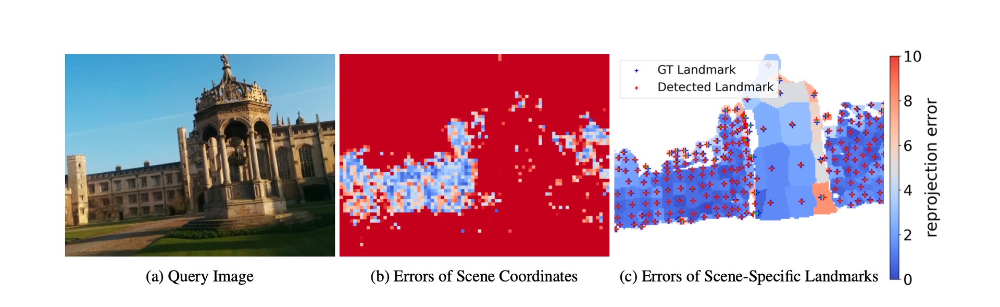

# VS-Net: Voting with Segmentation for Visual Localization
### [Project Page](https://drinkingcoder.github.io/publication/vs-net/) | [Paper](https://arxiv.org/abs/2105.10886)

> VS-Net: Voting with Segmentation for Visual Localization \
> [Zhaoyang Huang](https://drinkingcoder.github.io)<sup>\*</sup>, Han Zhou<sup>\*</sup>, Yijin Li, Bangbang Yang, Yan Xu, [Xiaowei Zhou](http://xzhou.me/), Hujun Bao, [Guofeng Zhang](http://www.cad.zju.edu.cn/home/gfzhang/), [Hongsheng Li](https://www.ee.cuhk.edu.hk/~hsli/) \
> CVPR 2021

<div style="text-align:center"></div>

<div style="text-align:center"></div>

### Requirements
We recommend Ubuntu 18.04, cuda 10.0, python 3.7.
```
conda env create -f environment.yaml
conda activate vsnet
cd scripts
sh environment.sh
```

### Data
Given a 3D mesh for a scene, we first decompose meshes into patches and select a landmark on a patch. Then, we compute ground truth patch segmentation maps and pixel-voting maps according to camera poses for training images. Please refer to our [paper](https://arxiv.org/abs/2105.10886) for more details. We evaluate our method on the Microsoft 7scenes dataset and the Cambridge Landmarks dataset. You can download the training data from [here](https://www.microsoft.com/en-us/research/project/rgb-d-dataset-7-scenes).  We provide our preprocessed training segmentation images [here](https://drive.google.com/drive/folders/1DzxTL8D7ym5bDWJkZ4FitT-yl2t7jCpr?usp=sharing). The voting images are generate with the following script.
```
python scripts/7scenes_preprocess.py --scene scene_name --root_dir /path/to/data
python scripts/cambridge_preprocess.py --scene scene_name --root_dir /path/to/data
```
In the end, you will get the following file tree.

```
7scenes_release
├── chess
│   ├── id2centers.json
│   ├── TrainSplit.txt
│   ├── TestSplit.txt
│   ├── seq-01
│   │   ├── frame-000000.color.png
│   │   ├── frame-000000.depth.png
│   │   ├── frame-000000.pose.txt
│   │   ├── frame-000000.seg.png
│   │   ├── frame-000000.vertex_2d.npy
│   │   ├── ...
│   ├── seq-02
│   ├── ...
├── heads
├── ...
```

### Evaluation
We provide 7scenes training params used in our paper in `collected_confgs/7scenes`.
The pretrained models could be found [here](https://drive.google.com/file/d/1p7mMtRtLXQXYCgKvolGVO-RQ3-7w3gYa/view?usp=sharing). All data are tested on RTX 2070 and i7-9700K.

```
python eval.py --dataset {dataset}_loc --resume true --config /path/to/config.json
# Example
# python eval.py --dataset 7scenes_loc --resume true --config collected_configs/7scenes/r.json
```

### Training
```
python train.py --dataset {dataset}_loc --scene {scene_name} --use-aug true --gpu-id gpu_device_id
# Example
# python train.py --dataset 7scenes_loc --scene heads --use-aug true --gpu-id 1
```


### Acknowledgements
Thanks Hanqing Jiang and Liyang Zhou for their assistance of building corresponding 3D meshes.
Our voting intersection code is built upon [PVNet](https://github.com/zju3dv/pvnet).

### Citation
```
@inproceedings{huang2021vs,
  title={{VS-Net}: Voting with Segmentation for Visual Localization},
  author={Huang, Zhaoyang and Zhou, Han and Li, Yijin and Yang, Bangbang and Xu, Yan and Zhou, Xiaowei and Bao, Hujun and Zhang, Guofeng and Li, Hongsheng},
  booktitle={Proceedings of the IEEE/CVF Conference on Computer Vision and Pattern Recognition},
  pages={6101--6111},
  year={2021}
}
```

### Copyright
This work is affiliated with ZJU-SenseTime Joint Lab of 3D Vision and CUHK-SenseTime Joint Lab. Its intellectual property belongs to SenseTime Group Ltd.
```
Copyright SenseTime. All Rights Reserved.

Licensed under the Apache License, Version 2.0 (the "License");
you may not use this file except in compliance with the License.
You may obtain a copy of the License at

    http://www.apache.org/licenses/LICENSE-2.0

Unless required by applicable law or agreed to in writing, software
distributed under the License is distributed on an "AS IS" BASIS,
WITHOUT WARRANTIES OR CONDITIONS OF ANY KIND, either express or implied.
See the License for the specific language governing permissions and
limitations under the License.

```